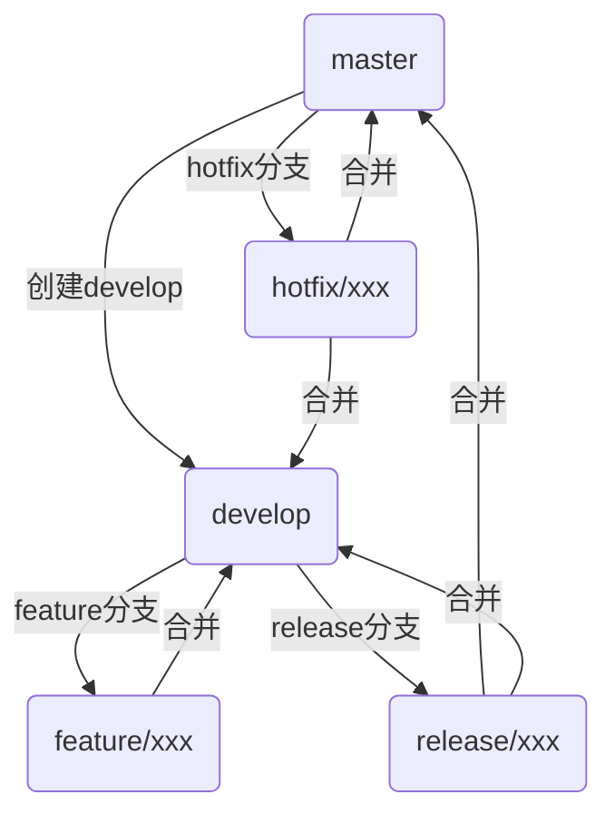

# Git Flow 工作流程指南

## 概要

Git Flow 是一种基于 Git 的分支管理工作流程模型，由 Vincent Driessen 在 2010 年提出。它为软件开发项目定义了严格的分支模型，适合有固定发布周期的项目。

## 一、分支类型与职责

### 1. 长期分支

- **master/main**：存放正式发布的历史，所有在 master 分支上的 commit 都对应一个可发布的版本。
- **develop**：用于集成功能分支，存放最新的开发成果，作为下一个发布版本的基础。

### 2. 临时分支

- **feature/**：开发新功能的分支，从 develop 分支分出，完成后合并回 develop。
- **release/**：准备发布新版本的分支，从 develop 分支分出，完成后合并回 master 和 develop。
- **hotfix/**：修复生产环境紧急问题，从 master 分支分出，完成后合并回 master 和 develop。
- **support/**（可选）：长期维护的历史版本分支。

### 3. 分支命名规范

- feature/xxx
- release/xxx
- hotfix/xxx
- support/xxx

建议分支名简洁明了，能体现功能或修复内容。

## 二、常用命令

```bash
# 初始化 git flow
git flow init

# 新建功能分支
git flow feature start <name>
git flow feature finish <name>

# 新建预发布分支
git flow release start <version>
git flow release finish <version>

# 新建热修复分支
git flow hotfix start <version>
git flow hotfix finish <version>
```

## 三、工作流示意图



## 四、常见问题

**Q: Git Flow 必须使用 git-flow 工具吗？**  
A: 不是必须的，git-flow 工具只是简化了操作，你可以手动按照 Git Flow 的原则管理分支。

**Q: feature 分支需要 rebase 吗？**  
A: 可以但不必须。如果选择 rebase，应该在本地完成，避免已推送的分支被重写历史。

**Q: 如何与远程仓库协作？**  
A: 每个功能/发布/热修复分支都可以推送到远程，便于团队协作和代码审查。

**Q: 分支合并冲突多怎么办？**  
A: 建议及时合并 develop，保持分支同步，减少冲突。

**Q: 适合小型项目吗？**  
A: 小型项目或快速迭代项目可以考虑简化分支策略，如 GitHub Flow。

## 五、优缺点

**优点：**

- 分支结构清晰，职责明确
- 适合有发布周期的项目
- 支持多人协作

**缺点：**

- 分支较多，管理复杂
- 不适合持续交付、快速迭代的项目
